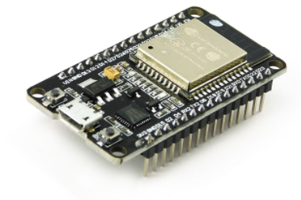
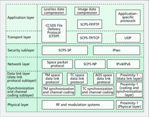
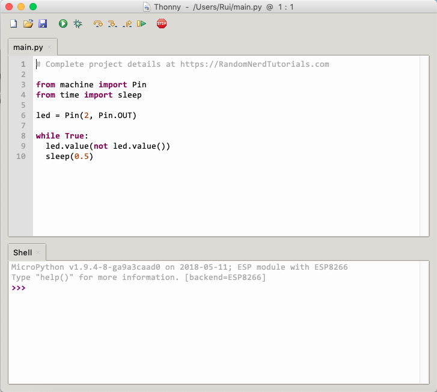

# <center>**Google Summer of Code 2021**</center>

## <center>CCSDS File Delivery Protocol in MicroPython</center>


### **Personal Details**

- **Name:** Shayan Majumder
- **University**: Birla Institute of Technology and Science, Pilani (BITS Pilani)
- **Email:** 
  - **Personal**: <shayan.majumder2@gmail.com>
  - **University**: <f20190259@pilani.bits-pilani.ac.in>
- **Linkedin**: <http://www.linkedin.com/in/shayan-79146519a>
- **IRC nick:** shayanmajumder
- **Github**: <https://github.com/ShayanMajumder>
- **Gitlab**:<https://gitlab.com/ShayanMajumder>
- **Phone:** +91 98364 58276
- **Country of Residence**: India
- **Timezone**: IST (GMT + 0530)
- **Primary Language**: English


I am a second-year student pursuing a B.E. in Electrical and Electronics Engineering at Birla Institute of Technology and Science, Pilani (BITS Pilani). My primary interest lies in programming and space exploration. My semester will complete in mid-May, leaving me enough time to get ready for my GSoC project. If I am selected, I shall work around 25 hours a week on the project, though I am open to putting in more effort if the work requires. My other engagements during this summer will be my Practice School which is needed for my university credits.


### **Introduction**


CCSDS  File  Delivery  Protocol  (CFDP)  is a  file transfer protocol for use in space,  e.g., between  Earth and spacecraft in  Earth orbit or between Earth and spacecraft on interplanetary missions. The  CCSDS  File  Delivery  Protocol (CFDP)  has been implemented in  Python by  LibreCube.   This project aims to make this the existing setup OS independent as well as make it compatible with micropython and hence extend its utilities as a ready-to-use space software. This will be demonstrated using the pyboard as the server and using UDP over WiFi.  This project will also include extending the capabilities of the current system and testing the system exhaustively. The CFDP  GUI  application developed by LibreCube shall be used for this and will be extended/modified as needed.




<center>Fig1: NodeMCU ESP32 WiFi development board</center>



<center>Fig 2: CCSDS File Delivery Protocol (CFDP) 
forms the link between the application layer and 
the transport layer in the CCSDS protocol stack</center>


### **Background Theory**


The CCSDS File Delivery Protocol can operate a wide range of machine configurations, from effortless ground-to-air space to complex systems of orbiters and rovers supported by multiple terrains and transmission links. The protocol enables the delivery of raw files that work in a single paired communication network. The CFDP file delivery capability can deliver files to any network containing multiple links.

The protocol is independent of the technology used to use data storage and requires only basic file store skills to work. For example, It takes two file stores, one inside the spacecraft (client), the other is on the ground(server), and it works by copying data between two file store locations. It makes no assumptions about the data which is being transferred. It thus can be utilized for a wide range of applications involving the Filestore requests, Proxy operations, Directory listing request, Native filestore implementation, and file transfer, both acknowledged and unacknowledged.

MicroPython is a lean and efficient implementation of the Python 3 programming language that includes a small subset of the Python standard library and is optimized to run on microcontrollers and constrained environments. MicroPython is packed full of advanced features such as an interactive prompt, arbitrary precision integer, closures, list comprehension, generators, exception handling, and more. It is compact enough to fit and run within just 256k of code space and 16k of RAM. MicroPython aims to be as compatible with standard Python as possible to allow you to transfer code with ease from the desktop to a microcontroller or embedded system.

Some of the micropython programmable microprocessors that support WiFi are [ESP8266](https://docs.micropython.org/en/latest/esp8266/quickref.html)(NodeMCU), [ESP32](https://docs.micropython.org/en/latest/esp32/quickref.html), and [WiPy/CC3200](https://docs.micropython.org/en/latest/wipy/quickref.html). The one I will be using for testing the system would be ESP32.

NodeMCU is an open-source firmware for which open-source prototyping board designs are available. The MicroPython software supports the ESP8266 chip itself, and any board with it will work. ESP 32 is an advanced version of this with additional capabilities including more RAM and Flash memory.



<center>Fig 3: Thonny IDE for Micropython</center>


### **Proposed Workflow**

First, I will ensure that the current CFDP project is fully OS independent with testing in Windows, macOS, Ubuntu, and some other LINUX distros. Then I will replace the existing libraries which are not yet implemented in micropython. For example- threading and queue libraries are not yet available in micropython packages but are crucial in the CFDP project.

The next stage will be testing PC to PC CFDP communication through WiFi. After this, I will start testing the functions by importing them to micropython and running it in the NodeMCU meanwhile trying simple WiFi communications with my PC. Once this is done, I will start testing and debugging the client-server applications one by one. After this, once a working setup is done in the command line, I will begin working in the python CFDP GUI.  Later I will start working on adding more functionalities to the CFDP application.


### **Technical Details**

1. **Core Tasks:**

    1. **Remove bit array dependency** - The bit array package requires GNU CC to be installed (on Linux) and Visual C++ on Windows. Thus removing it will lighten the installation process. (*Status - Done)*

    1. **Remove dependency of Threading and queue** - Currently, these modules are not supported on micropython, so replacing them would help port it.  (*Status - Ongoing)*

    1. **Replace shutil and tempfile module -**  These modules need to be replaced by their micropython derivatives. (*Status - To do*).

    1. **Setup NodeMCU -** The ESP32 MCU  needs to be set up and importing the files and testing the functions by running it in the MCU. *(Status - To do)*

    1. **Setup Network and Socket module** - These functions/modules for the NodeMCU need to be set up, tested, and made compatible with the CFDP module. *(Status - To do).*

    1. **Implementing Test Cases** - The same test cases as for the Python implementation shall be exercised. *(Status -To do)*

    1. **Improve CFDP GUI** - CFDP GUI application will be tweaked and improved as needed, and some features will be added. *(Status - To do)*.

    1. **Add Not implemented functions in the CFDP project** - Some of the recommended standards that haven’t been implemented will be implemented as needed. *(Status -To do).*


1. **Proposed Solutions :**


    1. To remove bit array dependency, use native Python code for bit pattern manipulation/reading.

    1. To remove threading, replacing it with [_thread ](https://docs.python.org/3/library/_thread.html)module seems feasible, replacing queue with an alternative to create a fixed-sized buffer used as a queue.  An alternative to both these methods will be using the [asyncio ](https://docs.python.org/3/library/asyncio.html)module implemented in micropython as [uasyncio](https://docs.micropython.org/en/latest/library/uasyncio.html?highlight=uasync).

    1. The shutil modules have been written in micropython as module [micropython-shutil](https://pypi.org/project/micropython-shutil/) and use the normal file methods, and use random file names as a prefix to the temporary created file. 

   1. Will setup the whole library to be ported to NodeMCU by installing drivers and setting up the IDE. Using [thonny ](https://thonny.org/)IDE for writing code and [ampy ](https://learn.adafruit.com/micropython-basics-load-files-and-run-code/install-ampy)to upload files .

    1. Implement the network module in ESP32 and initially test it out with PC by transmitting simple messages. Here are steps to connect with PC

    1. To setup the module, we will use this code and thus run it as a server.

```python

import network

wlan = network.WLAN(network.STA_IF) # create station interface 

wlan.active(True)       # activate the interface 

wlan.scan()             # scan for access points 

wlan.isconnected()      # check if the station is connected to an AP 

wlan.connect('essid', 'password') # connect to an AP 

wlan.config('mac')      # get the interface's MAC adddress 

wlan.ifconfig()         # get the interface's IP/netmask/gw/DNS addresses 

ap = network.WLAN(network.AP_IF) # create access-point interface 

ap.active(True)         # activate the interface 

ap.config(essid='ESP-AP') # set the ESSID of the access point
```
7. Next, connect the PC to this network by WiFi by using the given id and password.

1. Next, use the socket module to create a server in the ESP8266 using the socket module.


```python
#!/usr/bin/env python3 

from socket import socket, gethostbyname, AF_INET, SOCK_DGRAM 

import sys 

PORT_NUMBER = 5000 
SIZE = 1024 

hostName = gethostbyname( '0.0.0.0' ) 
mySocket = socket( AF_INET, SOCK_DGRAM ) 
mySocket.bind( (hostName, PORT_NUMBER) ) 

print ("Test server listening on port {0}\n".format(PORT_NUMBER))

while True: 
  
  (data,addr) = mySocket.recvfrom(SIZE) 
  
  print(data)

sys.exit()

  ```

9. Next run the client in my PC

 ```python
#!/usr/bin/env python3 
import sys 

from socket import socket, AF_INET, SOCK_DGRAM 

SERVER_IP   = '192.168.137.1' #IP address of the host 
PORT_NUMBER = 5000 

SIZE = 1024 

print ("Test client sending packets to IP {0}, via port {1}\n".format(SERVER_IP, PORT_NUMBER))

mySocket = socket( AF_INET, SOCK_DGRAM )
myMessage = "Hello!"
myMessage1 = ""
i = 0 

while i < 10:
   mySocket.sendto(myMessage.encode('utf-8'),(SERVER_IP,PORT_NUMBER))
   i = i + 1 

mySocket.sendto(myMessage1.encode('utf-8'),(SERVER_IP,PORT_NUMBER)) 
sys.exit()

  ```

1. The current version of the GUI will be improved by working on [issue#8](https://gitlab.com/librecube/prototypes/python-cfdp-gui/-/issues/8), [issue #5](https://gitlab.com/librecube/prototypes/python-cfdp-gui/-/issues/5), extended to support Class 2 transfer, and other added features as needed. 

1. The same series F1 and series F2 tests designed for the [Python CFDP](https://gitlab.com/librecube/prototypes/python-cfdp/-/tree/test_cases/tests) project will be tested in micropython.

1. The features that haven’t been implemented will be implemented as needed by referencing [CCSDS recommended standards.](https://public.ccsds.org/Publications/SIS.aspx)


### **Timeline**


#### **Community Bonding Period (May 17 - June 6) :**


- Introduce myself and this project in [Librecube IRC channel](https://app.element.io/#/room/#librecube.org:matrix.org), [LibreCube mailing list](mailto:librecube@freelists.org), and [LibreCube Forum](https://community.libre.space/c/librecube).

- Remain in constant touch with my mentors using mail and IRC. Set up requirements and discuss the design details with mentors. Settle the final design according to needs and feasibility.

- Discuss with mentors about the implementation plan.

- Setup development environment and [Taiga account](https://tree.taiga.io/project/librecube-librecube/us/185?kanban-status=1911016) for TODO list and weekly report.


#### **Official Coding Period (June 7 - August 23)** 


- **Week 1 (June 7 - June 13)**

    - Test the OS independency of the current Python CFDP project.

    - Start testing the NodeMCU and test simple transfers over WiFi.

- **Week 2-3 (June 14 - June 27)**

    - Remove and test complete removal of dependency of modules such as threading and queues which are not supported by micropython
    - Start working on the removal of modules such as shutil and tempfile using alternatives.

    - Start working on setting up the transport layer using UDP, Networking, etc.


- **Week 4 -5 (June 28 - July 11)**

    - Debug and make sure all functions work properly when imported in Micropython. 

    - Test that the CFDP module is importable in Micropython and thus carries out client-server file transfers.


- ` `**Phase 1 evaluation period (July 12 - July 16)** 

    - An OS-independent, easily portable library without any external dependencies.

    - This project’s full or partial working setup where MicroPython runs a CFDP server entity and a laptop or PC that runs a CFDP client entity and connects to it using UDP transport over WiFi.

- **Week 6-7 (July 17-25)**

    - Start working on the CFDP-GUI adding additional features and making it a ready to use software.

    - Testing and debugging for the test cases on micropython.

- **Week 8 ( July 26 - August 1)**

    - Document the existing code and write a blog to show how to setup the micropython environment for working on this.

- **Week 9-10-11(August 2 - August 23)**

    - Submit final merge request to the main branch

    - This time will also act as a buffer time incase I miss the present deadlines .

    - If all goes well I will start working on other projects under LibreCube. For example implementing CFDP protocol in GNU radio.


### **Deliverables** 

1. An OS independent Python CFDP library

1. A working setup of the CFDP project in micropython.

1. Proper documentation in the form of Pydocs and Blogs.

### **Personal Inspiration for the Project**

I have been working in space communications for some time now, and I seek to leverage my exposure by working with experienced people from the industry. This particular project interests me more since it would make it easier for future amateur space missions to easily integrate the protocol layers into their own system and reduce their work. My experience includes framing and deframing packets and extracting information in C and GNU Radio, a free and open-source signal processing toolkit. The CCSDS File Delivery Protocol MicroPython implementation would also help extend the utility of the current Python-CFDP project and help amateur space missions easily integrate it in their own system as well as help other earth based amateur projects get a reliable method of transferring files. I have also contributed to the LibreCube organization in [decoding cluster frames](https://gitlab.com/artur-scholz/decode-cluster-frames/-/issues/1), [adding OMM support in the LinkPredict library](https://gitlab.com/librecube/lib/python-linkpredict/-/issues/3) and [removing bitarray dependency for the Python CFDP project](https://gitlab.com/librecube/prototypes/python-cfdp/-/issues/24).

### **References**

1. <https://micropython.org/>

1. <https://gitlab.com/librecube/prototypes/python-cfdp>

1. <https://public.ccsds.org/Publications/SIS.aspx>

1. <https://docs.micropython.org/en/latest/index.html>

1. <https://gitlab.com/librecube/prototypes/python-cfdp-gui>


